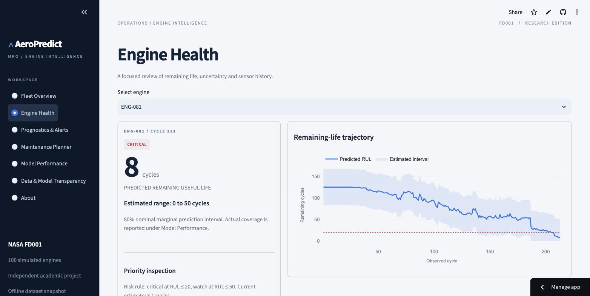
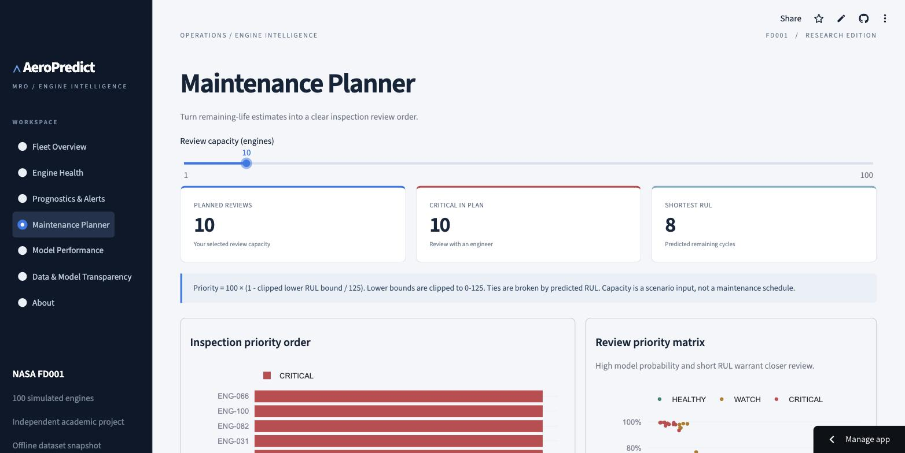
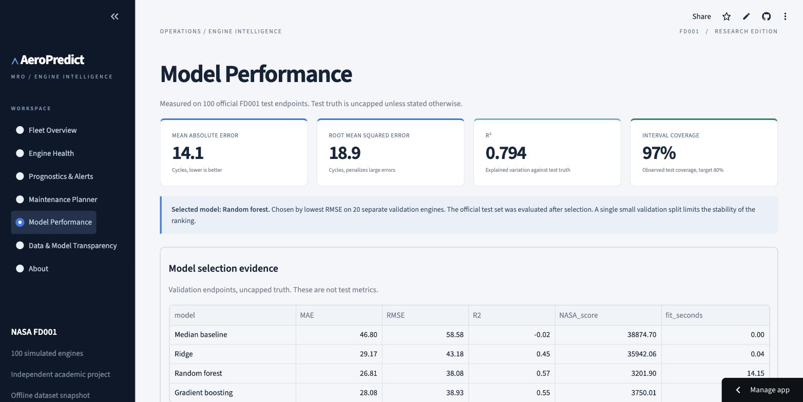

# AeroPredict MRO
### Predictive Aircraft Engine Health & Maintenance Decision Support

A clear review workspace for simulated turbofan engines: understand fleet health, inspect remaining-life estimates and prioritize engineering attention. Built as an independent end-to-end academic product using public NASA C-MAPSS FD001.

## Live demo
[aeropredict-mro.streamlit.app](https://aeropredict-mro.streamlit.app/). Deployed from the `main` branch on Streamlit Community Cloud, Python 3.12. The application also runs locally with the commands below.







## Interactive Engine Studio

The default application now opens a French-language React + Three.js workspace:
explore five engine assemblies, rotate/zoom, reveal the interior, separate sections,
follow a guided tour, inspect real prepared NASA predictions, filter alerts and
export a review list. A software renderer keeps the 3D usable without WebGL.

[Open AeroPredict](https://aeropredict-mro.streamlit.app/) ·
[Original scientific views](https://aeropredict-mro.streamlit.app/?experience=classic)

The 3D is an original simplified teaching model, not certified CAD or a component
fault diagnosis. GPU rendering was not available in the validation browser;
software-rendered 3D and the core navigation were verified on the deployed preview.
See [frontend build and architecture](frontend/README.md) for reproducible builds.

## Problem and business value
Sensor histories are difficult to prioritize directly. AeroPredict turns them into RUL estimates, uncertainty intervals and transparent inspection review categories. It demonstrates a decision workflow, not quantified real-world savings or operational safety performance.

## Results
Selected model: **Random forest**, selected on a separate 20-engine validation sample. These results are measured on all 100 official FD001 test endpoints, using uncapped truth.

| Metric | Official test result |
|---|---:|
| MAE | 14.1259 |
| RMSE | 18.8587 |
| R2 | 0.7940 |
| NASA_score | 648.2540 |


Classifier recall: **0.84**, precision: **0.875**, F1: **0.857**. Interval coverage: **97%**, versus 80% nominal target; intervals are wide (radius 41.7 cycles). Coverage must be assessed alongside width. The uncertainty method does not establish individual-engine safety.

## Application
1. Fleet Overview: executive KPIs, fleet balance, remaining-life map and priority engines.
2. Engine Health: engine selection, RUL history, uncertainty, sensor trajectories and revealed historical truth.
3. Prognostics & Alerts: filterable endpoint review queue with reasons and recommendations.
4. Maintenance Planner: capacity scenario, ranked reviews, priority matrix and CSV export.
5. Model Performance: comparison, residuals, classification, importance and operational interpretation.
6. Data & Model Transparency: pipeline, quality controls, leakage prevention and scope.
7. About: product purpose, architecture, references and independence statement.

## Architecture and dataset
See [architecture](docs/architecture.md), [data dictionary](docs/data_dictionary.md) and [methodology](docs/methodology.md). FD001 has 100 training and 100 test engines, 20,631 train observations and 13,096 test observations. Training engines split 60/20/20 for fit, selection and calibration. Raw data and prepared artifacts are included for a self-contained demo.

## Installation and usage
Python 3.12 is the tested runtime. From the repository directory:

```bash
python -m venv .venv
source .venv/bin/activate
pip install -r requirements.txt
python -m streamlit run app.py
```

On Windows, activate with `.venv\Scripts\activate`.

## Rebuild and evaluate
```bash
python scripts/download_data.py
python scripts/train_models.py
python scripts/build_documentation.py
python scripts/build_notebooks.py
python -m pytest -q
python -m compileall -q src scripts app.py
```

Training is offline. Streamlit reads cached prepared files only. It does not download data or train at startup. Pinning scikit-learn is required to load the saved model consistently. Load joblib files only from trusted sources.

## Repository structure
| Directory | Purpose |
|---|---|
| src/ | Shared features, inference, decisions and interface |
| scripts/ | Data acquisition, training, documentation and notebooks |
| data/raw/ | Official FD001 data and provenance |
| data/processed/ | Precomputed fleet and sensor histories |
| artifacts/models/ | Trained models |
| artifacts/metrics/ | Actual evaluation outputs |
| notebooks/ | Executed educational analysis |
| tests/ | Leakage, inference, rule and interface checks |
| docs/ | Methodology, architecture, model card and design |
| reports/ | Academic report |

## Validation and screenshots
See [validation status](docs/validation.md) for exactly which checks were completed, including the cloud deployment and browser verification.

## Limitations
One simulated operating regime and fault mode. A small single validation split. No cap sensitivity analysis, external industrial validation or calibrated failure probability. Health and priority scores are transparent academic constructions. No anomaly detector is retained without evidence of added value.

## Disclaimer
Academic predictive-maintenance demonstrator inspired by publicly described MRO predictive-maintenance principles. Built exclusively with the public NASA C-MAPSS dataset. This project is not affiliated with Air France-KLM or AFI KLM E&M and does not reproduce PROGNOS proprietary algorithms.

## License
MIT for original code. Dataset and source paper remain subject to their original NASA/source terms; the code license does not relicense them. The original AI-generated aircraft image is decorative and is not a technical diagram.

## References
1. [NASA PCoE dataset repository](https://www.nasa.gov/intelligent-systems-division/discovery-and-systems-health/pcoe/pcoe-data-set-repository/). Saxena, A. and Goebel, K. (2008), Turbofan Engine Degradation Simulation Data Set.
2. Saxena, A., Goebel, K., Simon, D. and Eklund, N. (2008). Damage Propagation Modeling for Aircraft Engine Run-to-Failure Simulation. PHM08. Original paper included in the source archive.
3. [AFI KLM E&M public PROGNOS presentation](https://vimeo.com/220937470). Public operational inspiration only.
4. [Streamlit Community Cloud deployment](https://docs.streamlit.io/deploy/streamlit-community-cloud/deploy-your-app).
5. [Streamlit navigation API](https://docs.streamlit.io/develop/api-reference/navigation/st.navigation).
