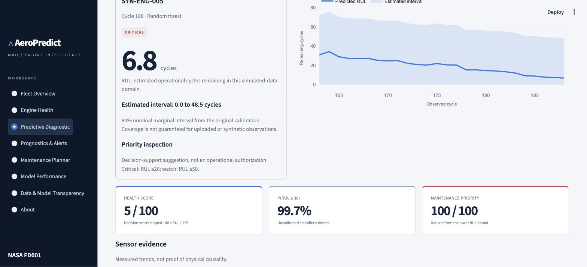
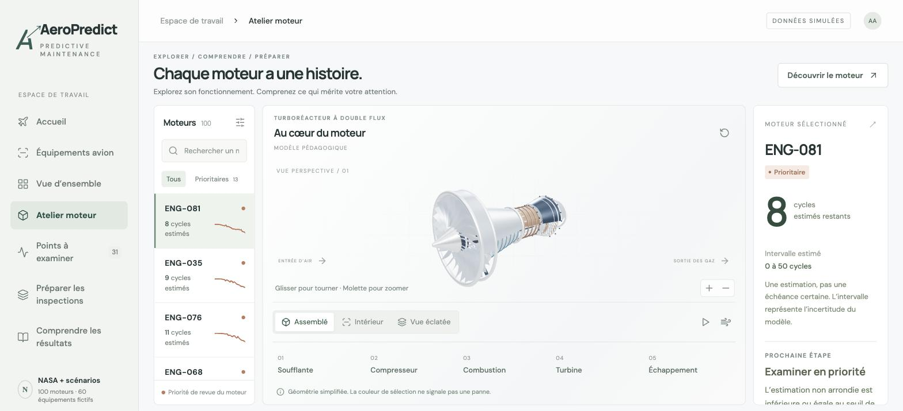

# AeroPredict MRO
### Predictive Maintenance & Engine Prognostics Decision Support

A review workspace for simulated turbofan engines: turn sensor histories into remaining-life estimates, uncertainty and prioritized engineering attention. Built as an independent end-to-end academic product using public NASA C-MAPSS FD001.

**[Open the live demo →](https://aeropredict-mro.streamlit.app/)** · deployed from `main` on Streamlit Community Cloud, Python 3.12.


## What AeroPredict does

```text
sensor histories → feature engineering → trained model → RUL → uncertainty → health & risk → inspection decision support
```

Every prediction traces back to the same saved model and the same causal feature pipeline, whether it reviews one of the 100 NASA benchmark engines already on file (**Engine Health**) or runs fresh inference on observations a user supplies (**Predictive Diagnostic**). Nothing is retrained at request time.

## Predictive Diagnostic

Run the trained model against new engine observations, from the classic workspace (`?experience=classic`, **Predictive Diagnostic**, next to Engine Health):

- **Demo engine** — five synthetic scenarios (`SYN-ENG-001`…`005`) spanning healthy to critical
- **Manual entry** — an editable table, one row per consecutive cycle
- **Upload CSV** — a downloadable template, schema validation, then inference

Supply at least 5 consecutive cycles (10+ recommended) of `cycle, s2, s3, s4, s6, s7, s8, s9, s11, s12, s13, s14, s15, s17, s20, s21`. Validation catches missing, non-numeric, infinite or duplicated values, gaps, unordered rows and out-of-schema columns; an optional `engine_id` is metadata only and never enters model features. Every result — predicted RUL, interval, health score, risk, P(RUL ≤ 30), maintenance priority, recommendation, RUL/uncertainty charts and sensor evidence — comes from the same `artifacts/models/bundle.joblib` through `src.inference.predict`, with a training-domain compatibility warning when inputs fall outside the fitted sensor ranges.



## Interactive A350 Digital Twin

The default landing experience explains predictive maintenance before opening any data: a rotatable, original procedural A350-900 exterior with six labelled zones — engine, APU, brakes, hydraulics, air conditioning pack and flap actuator. Selecting a zone transitions from the assembled aircraft into a focused, exploded equipment view, and back. Five non-engine systems carry synthetic histories for twelve fictitious aircraft, entirely separate from the NASA engine predictions. A Canvas 2D software renderer keeps every view usable without WebGL.



## Scientific Engine Analytics

The original seven-page workspace (`?experience=classic`) reviews the 100 NASA FD001 benchmark engines: Fleet Overview, **Engine Health** (RUL history, uncertainty, sensor trajectories), Prognostics & Alerts, Maintenance Planner, **Model Performance** (comparison, residuals, classification, importance) and Data & Model Transparency.

| Metric | Official test result |
|---|---:|
| MAE | 14.1259 |
| RMSE | 18.8587 |
| R2 | 0.7940 |
| NASA_score | 648.2540 |

Classifier recall: **0.84**, precision: **0.875**, F1: **0.857**. Interval coverage: **97%**, versus 80% nominal target; intervals are wide (radius 41.7 cycles). Coverage must be assessed alongside width. The uncertainty method does not establish individual-engine safety.


## Application

| Page | What it does |
|---|---|
| A350 Home / Aircraft Exploration | Landing experience explaining predictive maintenance around a rotatable A350-900 |
| Equipment Exploration | Engine, APU, brakes, hydraulics, air conditioning, actuator — assembled/exploded views |
| **Predictive Diagnostic** | **Runs new inference** on a demo, manually entered or uploaded engine history |
| Fleet Overview | Executive KPIs, fleet balance, remaining-life map, priority engines |
| **Engine Health** | **Reviews benchmark engines already on file** — RUL history, uncertainty, sensor trajectories |
| Prognostics & Alerts | Filterable endpoint review queue with reasons and recommendations |
| Maintenance Planner | Capacity scenario, ranked reviews, priority matrix, CSV export |
| Model Performance | Comparison, residuals, classification, importance, operational interpretation |
| Data & Model Transparency | Pipeline, quality controls, leakage prevention, scope |
| About | Product purpose, architecture, references, independence statement |

The distinction that matters: **Engine Health** analyzes benchmark engines already present in the prepared NASA data; **Predictive Diagnostic** runs new inference from observations a user supplies, through the identical saved model.

## Architecture and dataset
See [architecture](docs/architecture.md), [data dictionary](docs/data_dictionary.md) and [methodology](docs/methodology.md). FD001 has 100 training and 100 test engines, 20,631 train observations and 13,096 test observations. Training engines split 60/20/20 for fit, selection and calibration. Raw data and prepared artifacts are included for a self-contained demo.

## Installation and usage
Python 3.12 is the tested runtime. From the repository directory:

```bash
python -m venv .venv
source .venv/bin/activate
pip install -r requirements.txt
python -m streamlit run app.py
```

On Windows, activate with `.venv\Scripts\activate`.

## Rebuild and evaluate
```bash
python scripts/download_data.py
python scripts/train_models.py
python scripts/build_documentation.py
python scripts/build_notebooks.py
python -m pytest -q
python -m compileall -q src scripts app.py
```

Training is offline. Streamlit reads cached prepared files only. It does not download data or train at startup. Pinning scikit-learn is required to load the saved model consistently. Load joblib files only from trusted sources.

For the React + Three.js aircraft/equipment frontend, see [frontend build and architecture](frontend/README.md) — `python scripts/export_studio_data.py`, `npm ci --prefix frontend`, `npm run build --prefix frontend`, `python scripts/package_studio.py`, then `python -m pytest -q`.

## Repository structure
| Directory | Purpose |
|---|---|
| src/ | Shared features, inference, decisions, diagnostic sandbox and interface |
| frontend/ | React + Three.js aircraft/equipment studio |
| scripts/ | Data acquisition, training, documentation, notebooks and synthetic generators |
| data/raw/ | Official FD001 data and provenance |
| data/processed/ | Precomputed fleet and sensor histories |
| data/synthetic/ | Synthetic equipment scenarios and diagnostic-sandbox engines (excluded from training/metrics) |
| artifacts/models/ | Trained models |
| artifacts/metrics/ | Actual evaluation outputs |
| notebooks/ | Executed educational analysis |
| tests/ | Leakage, inference, rule, diagnostic and interface checks |
| docs/ | Methodology, architecture, model card, validation and design |
| reports/ | Academic report |

## Data and model transparency

Four data domains stay explicitly separate, never blended:

1. **NASA FD001 raw dataset** — the official train/test archive, used for training and evaluation.
2. **Processed benchmark outputs** — precomputed predictions for the 100 FD001 engines shown in Engine Health, Fleet Overview, etc.
3. **Synthetic aircraft equipment scenarios** (`data/synthetic/equipment_signals.csv`) — twelve fictitious aircraft driving the APU/brakes/hydraulics/air-conditioning/actuator views, with illustrative thresholds, not calibrated RUL.
4. **Synthetic diagnostic-engine sandbox** (`data/synthetic/diagnostic_engines.csv`) — 5 engines × 30 observations backing Predictive Diagnostic's demo mode. These are training-derived, perturbed histories, not independent validation engines. They **never** participate in training, validation, calibration or the official metrics above — they exist only to demonstrate inference on new data.

The current selected model, its official metrics and every number in the Results table above are unchanged by Predictive Diagnostic. The new page performs inference through the existing `artifacts/models/bundle.joblib`, never retraining. Minimum input history is 5 cycles (10+ recommended); required sensors are `s2, s3, s4, s6, s7, s8, s9, s11, s12, s13, s14, s15, s17, s20, s21`; observations outside the fitted training range trigger a compatibility warning rather than a silent extrapolation. See [model card](docs/model_card.md) and [validation status](docs/validation.md) for full detail.

## Limitations
One simulated operating regime and fault mode. A small single validation split. No cap sensitivity analysis, external industrial validation or calibrated failure probability. Health and priority scores are transparent academic constructions. No anomaly detector is retained without evidence of added value. Predictive Diagnostic's synthetic demo engines are training-derived and do not prove generalization to independent data.

## Disclaimer
Academic predictive-maintenance demonstrator inspired by publicly described MRO predictive-maintenance principles. Built exclusively with the public NASA C-MAPSS dataset. This project is not affiliated with Air France-KLM, AFI KLM E&M, Airbus or NASA (credited only as the dataset source), and does not reproduce PROGNOS proprietary algorithms. Never use these predictions to authorize operation of a real aircraft.

## License
MIT for original code. Dataset and source paper remain subject to their original NASA/source terms; the code license does not relicense them. The A350-900 exterior is sourced from the GPL-2.0-or-later FlightGear project (see [third_party/flightgear-a350](third_party/flightgear-a350/README.md)).

## References
1. [NASA PCoE dataset repository](https://www.nasa.gov/intelligent-systems-division/discovery-and-systems-health/pcoe/pcoe-data-set-repository/). Saxena, A. and Goebel, K. (2008), Turbofan Engine Degradation Simulation Data Set.
2. Saxena, A., Goebel, K., Simon, D. and Eklund, N. (2008). Damage Propagation Modeling for Aircraft Engine Run-to-Failure Simulation. PHM08. Original paper included in the source archive.
3. [AFI KLM E&M public PROGNOS presentation](https://vimeo.com/220937470). Public operational inspiration only.
4. [Streamlit Community Cloud deployment](https://docs.streamlit.io/deploy/streamlit-community-cloud/deploy-your-app).
5. [Streamlit navigation API](https://docs.streamlit.io/develop/api-reference/navigation/st.navigation).

## Synthetic diagnostic database

`data/synthetic/diagnostic_engines.csv` contains 5 synthetic IDs × 30 observations = 150 rows, independent of `equipment_signals.csv`. `diagnostic_engines.json` records source training engine, lifetime positions, channels, method and seed **20260914**. Regenerate with `python scripts/generate_diagnostic_engines.py`.

The generator selects the smallest engine ID in the **fitted training split** recorded in results.json. It takes 30-cycle histories ending at 30%, 55%, 75%, 90% and 98% of that training engine's lifetime, perturbs each measurement by uniform noise bounded to ±1.5% of fitted-training sensor IQR, and clips to fitted-training min/max. This conservative approach preserves plausible cross-channel structure approximately; these are training-derived, perturbed examples, not independent validation engines or simulated real-world A350 operations. No RUL value is assigned. No official test endpoint truth is consulted. Demo outputs reflect the saved model's behavior on familiar training-derived patterns and do not prove generalization.

The database is an **inference sandbox only**, excluded from training, validation, calibration and official model metrics. No existing model, metric, evaluation dataset or A350 geometry/camera/transition file is altered by this module.

## Non-destructive feature-selection review

`artifacts/metrics/feature_selection_review.csv` summarizes existing validation permutation importance only. Of 61 features, 18 have nonpositive estimated importance. Top 30, 20, 15 and 10 account for approximately 99.3%, 97.2%, 95.4% and 87.6% of positive importance. Correlated features and only 20 validation endpoints make these estimates unstable: nonpositive importance does not prove uselessness. A future reduced-feature retraining experiment using the same training/validation split is warranted, particularly top 20/30. No reduced model was trained, no performance advantage is claimed and production features remain unchanged. Calibration and official test data must remain untouched during that future selection experiment.
