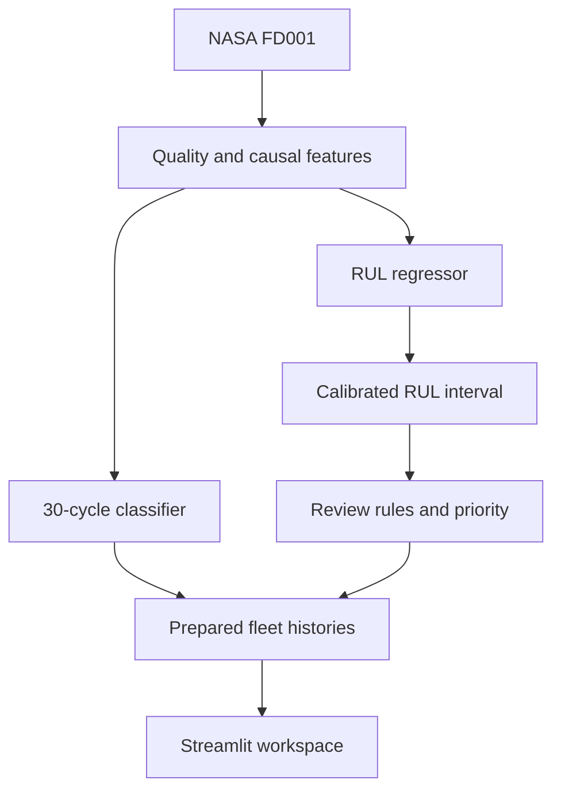
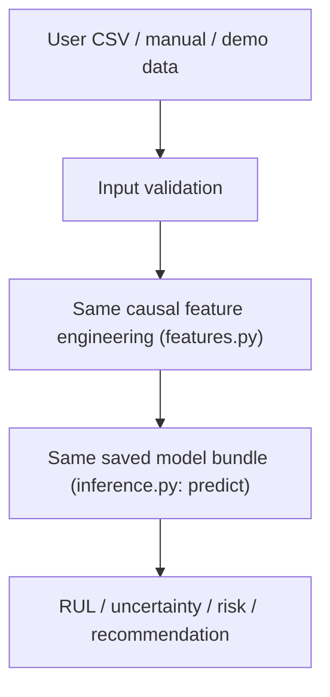

# Architecture

Offline acquisition validates and fingerprints the NASA archive. Feature engineering and model training share the same functions as inference. Inference produces per-cycle histories and a last-observed-cycle fleet snapshot. The runtime caches prepared data and renders seven views; it never trains models.

src/config.py centralizes thresholds. data_loader.py validates input. features.py contains causal transforms. inference.py reuses these transforms. business_rules.py isolates academic decisions. views.py contains page composition and ui.py centralizes visual tokens and components. artifacts/metrics stores actual results, not manually entered claims.

## Predictive Diagnostic: the same model, a second entry point

Predictive Diagnostic (`src/diagnostic.py`, `src/diagnostic_view.py`) adds a second path into the same trained model, never a second model:

Both paths converge on the identical `artifacts/models/bundle.joblib` through `src.inference.predict`; the diagnostic path never retrains and never writes back into the training/evaluation artifacts above. Its demo data (`data/synthetic/diagnostic_engines.csv`) is excluded from training, validation, calibration and official metrics — see the [data dictionary](data_dictionary.md).

## Synthetic equipment scenarios: a separate, illustrative system

The A350 studio's non-engine equipment (APU, brakes, hydraulics, air conditioning, actuator) is driven by its own generator (`scripts/generate_aircraft_scenarios.py` → `data/synthetic/equipment_signals.csv`) and a client-side linear-threshold projection (`frontend/src/prediction.js`), independent of the NASA-trained model and of Predictive Diagnostic's sandbox engines. These three data sources — NASA FD001, the diagnostic sandbox, and the equipment scenarios — are never blended.
