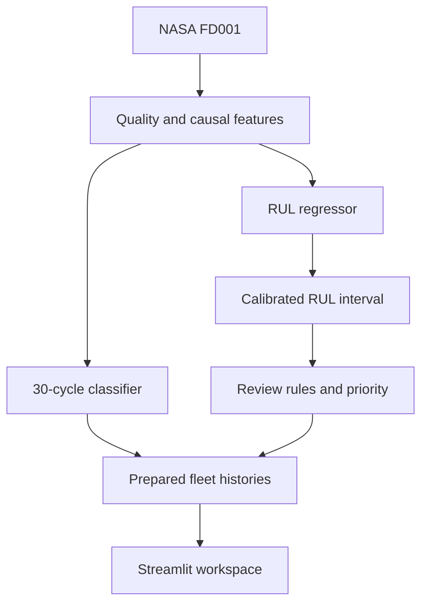

# Architecture

Offline acquisition validates and fingerprints the NASA archive. Feature engineering and model training share the same functions as inference. Inference produces per-cycle histories and a last-observed-cycle fleet snapshot. The runtime caches prepared data and renders seven views; it never trains models.

src/config.py centralizes thresholds. data_loader.py validates input. features.py contains causal transforms. inference.py reuses these transforms. business_rules.py isolates academic decisions. views.py contains page composition and ui.py centralizes visual tokens and components. artifacts/metrics stores actual results, not manually entered claims.
